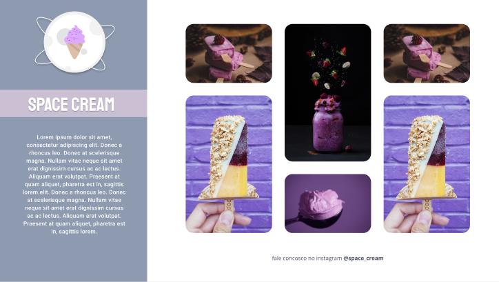

## 🖥️ Projeto

 Demostração dos produtos.
Página responsiva.

## ✍️ Aprendizagem

- Definindo largura máxima e alinhando o contéudo
- Encaixando a imagem e sobrepondo o texto
- Finalizando os cards
- Transições e transformações
- animações com CSS
- Adicionando filtros em imagens com CSS
- Ajustando textos com CSS clamp

## 🚀 Tecnologias

Esse projeto foi desenvolvido durante o EXPLORER- programação web da Rocketseat com as seguintes tecnologias:

- HTML
- CSS

## 🏷️ Layout

Você pode visualizar o layout do projeto através
[desse link](https://www.figma.com/file/QXsF9qN76NgkGhhX1qNB46/Stage-03---Grid-com-anima%C3%A7%C3%B5es-(Copy)?type=design&node-id=0%3A1&t=cr3YCoBQevFgrjRq-1).
É necessário ter uma conta no [Figma](https://www.figma.com/)

Feito com ❤️ por <strong>Luciana</strong>. Me acompanhe nas [redes sociais!](https://luciana-maria.github.io/Cartao-de-visita-Rocketseat/)